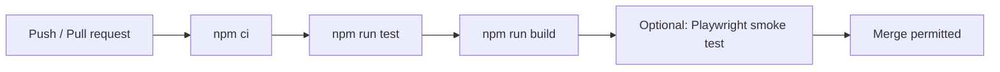

# Synapse — Architecture & Development Pipeline

> **Purpose:** A visual, local-first active-recall canvas. Users create hierarchical learning nodes, pan/zoom the canvas, edit nodes inline, tag their recall status, collapse branches, and retain their canvas locally.

## 1. Current project map

```text
synapse/
├── src/
│   ├── app/                                  # Next.js App Router: routing + app shell
│   │   ├── layout.tsx                         # Root HTML shell, global CSS, metadata
│   │   ├── page.tsx                           # Redirects / → /canvas/default
│   │   ├── globals.css                        # Original canvas design system and component CSS
│   │   └── canvas/
│   │       └── [id]/
│   │           └── page.tsx                   # Dynamic canvas route, renders <Canvas>
│   │
│   ├── components/
│   │   ├── Canvas/
│   │   │   ├── Canvas.tsx                     # Canvas composition; viewport, edges, controls,
│   │   │   │                                  # gestures, stats and local UI coordination
│   │   │   ├── Node.tsx                       # One node card: edit, status, child, drag, delete
│   │   │   └── Toolbar.tsx                    # Create-root / collapse-all / expand-all controls
│   │   └── ui/
│   │       ├── Button.tsx                     # Reusable styled button primitive
│   │       └── StatusBadge.tsx                # Status-dot interaction primitive
│   │
│   ├── lib/                                  # Framework-independent domain/state layer
│   │   ├── types.ts                           # Canvas, Node, Status and shared constants
│   │   ├── store.ts                           # Zustand store, command actions, seed data
│   │   ├── persistence.ts                     # Browser localStorage load/save boundary
│   │   └── operations/
│   │       ├── nodes.ts                       # Node factory
│   │       ├── hierarchy.ts                   # Roots, children, descendants, visible tree order
│   │       └── status.ts                      # Direct-child status aggregation
│   │
│   └── hooks/                                # Reserved for reusable UI hooks (currently empty)
│
├── public/                                   # Static files when they are introduced
├── tests/                                    # Reserved for unit/integration tests
├── package.json                              # Scripts and dependency versions
├── tsconfig.json                             # TypeScript + @/* path alias
├── next.config.mjs                           # Next configuration
└── ARCHITECTURE.md                           # This document
```

## 2. Runtime flow

```mermaid
flowchart TD
  A[Browser: /] --> B[app/page.tsx redirect]
  B --> C[/canvas/default]
  C --> D[app/canvas/[id]/page.tsx]
  D --> E[Canvas component]
  E --> F[Zustand canvas store]
  F --> G{Saved canvas exists?}
  G -- yes --> H[localStorage load]
  G -- no --> I[Seed sample medical tree]
  H --> J[Render nodes, connectors, stats]
  I --> J
  J --> K[User action: edit / create / move / tag / collapse]
  K --> L[Store command action]
  L --> M[Immutable canvas update]
  M --> J
  M --> N[400 ms debounced localStorage save]
```

### State ownership

| Concern | Owner | Notes |
|---|---|---|
| Canvas nodes, hierarchy, viewport | `useCanvasStore` | Canonical client-side state. |
| Temporary editing / creation UI state | `useCanvasStore` | `editingId`, `justCreatedId`. |
| Pointer gesture state | `Canvas.tsx` | Kept local because it is ephemeral UI state. |
| Draft editor text | `Node.tsx` | Saved on blur or Enter; Escape exits edit mode. |
| Persistent storage | `persistence.ts` | Stored per canvas under `synapse:v1:canvas:<id>`. |

## 3. Important domain rules

- A `Node` belongs to either a parent node or the root (`parentId: null`).
- The screen renders **only nodes whose ancestors are expanded**. `visibleOrder()` controls this.
- Delete is cascading: the selected node and all descendants are removed.
- Status cycles in this order: `none → failed → review → mastered → none`.
- Collapsed-node summaries aggregate **direct children only**.
- Node coordinates are in world space. Viewport state applies `translate(x, y) scale(zoom)`.
- A node’s children are placed one horizontal indent to the right; new siblings are placed below existing siblings.

## 4. Development commands

```bash
# Install dependencies
npm install

# Local development server
npm run dev

# Production validation (TypeScript + Next production compile)
npm run build

# Serve a production build after npm run build
npm run start

# Unit tests (once test files are added)
npm run test
```

## 5. Recommended developer workflow

### Before starting work

1. Pull/rebase on the target branch.
2. Run `npm install` after lockfile changes.
3. Run `npm run build` to confirm a clean baseline.
4. Start the application with `npm run dev`.

### For every feature or bug fix

1. Create a focused branch, for example:
   - `feat/canvas-export`
   - `fix/node-drag-position`
   - `refactor/persistence-adapter`
2. Keep domain logic out of components where possible:
   - Tree calculations → `src/lib/operations/`
   - Storage/API adapters → `src/lib/`
   - UI composition → `src/components/`
   - Page routing/layout → `src/app/`
3. Add or update tests for pure logic first.
4. Manually verify the affected interaction in the browser.
5. Run `npm run build` before opening a pull request.
6. Keep commits small and intention-revealing, e.g. `feat: add canvas export command`.

### Pull-request acceptance checklist

- [ ] TypeScript build succeeds: `npm run build`
- [ ] Existing interactions still work: create, edit, status cycle, collapse/expand, drag, zoom/pan, delete
- [ ] New pure logic has focused tests
- [ ] UI works at desktop and narrow widths
- [ ] No storage-key migration is introduced without a migration strategy
- [ ] PR description documents behavior and any data-shape change

## 6. Recommended version-control policy

### Branch model

```text
main                 stable, deployable releases only
└── develop          optional integration branch for a multi-developer team
    ├── feat/*       new isolated product work
    ├── fix/*        user-facing defect fixes
    ├── refactor/*   non-functional code restructuring
    └── chore/*      tooling, dependencies and documentation
```

For a small team, use short-lived `feat/*` and `fix/*` branches directly from `main`; merge through reviewed pull requests. Protect `main` and require the build check.

### Versioning

Use Semantic Versioning:

- **MAJOR** (`2.0.0`): breaking storage model, routing, API, or public behavior.
- **MINOR** (`1.1.0`): backward-compatible feature.
- **PATCH** (`1.0.1`): backward-compatible bug fix.

Use conventional commit prefixes to make release notes automatable:

```text
feat: add JSON canvas export
fix: keep connector aligned while dragging
refactor: extract viewport gestures into a hook
test: cover visible node traversal
docs: document local storage schema
chore: update Next.js patch version
```

## 7. Testing strategy

### Unit tests — highest priority

Add tests under `tests/` for operations that do not require a browser:

```text
tests/
├── hierarchy.test.ts       # roots, children, descendants, visibleOrder
├── status.test.ts          # direct-child summaries
├── nodes.test.ts           # default node model
└── persistence.test.ts     # invalid/corrupt saved data handling
```

Recommended minimum test cases:

- A collapsed node hides all of its nested descendants.
- Deletion receives every descendant exactly once.
- Root and child ordering is deterministic by `createdAt`.
- Status aggregation ignores grandchildren.
- Corrupt stored data results in a usable fresh canvas.

### Component/integration tests — next step

Introduce React Testing Library and JSDOM for behavior such as inline edit saving, status cycling, and toolbar actions.

### End-to-end tests — release confidence

Introduce Playwright for the critical user path:

1. Create root node.
2. Enter text.
3. Add a child.
4. Change its status.
5. Collapse and expand the parent.
6. Reload and assert the canvas was restored from local storage.

## 8. CI pipeline recommendation

Add a CI workflow such as `.github/workflows/ci.yml` when GitHub is used:



Required checks should be:

```bash
npm ci
npm run test
npm run build
```

For deployment, build the exact commit accepted by CI. Promote the same immutable build artifact from preview/staging to production rather than rebuilding separately.

## 9. Near-term refactoring roadmap

The current implementation is functional and intentionally close to the original single-file behavior. These improvements make it easier to evolve safely:

1. **Extract `useViewport.ts`**
   - Move pan, zoom, fit, and drag gesture code from `Canvas.tsx` into focused hooks.
2. **Create a `CanvasEdges.tsx` component**
   - Isolate SVG connector calculations and support measured card heights.
3. **Create a storage adapter interface**
   - Keep `localStorage` now, while allowing a future server/database implementation.
4. **Add schema versioning**
   - Include `schemaVersion` in `CanvasData` before changing persisted node data.
5. **Replace browser confirm with a modal component**
   - Match the original UX and make it accessible/testable.
6. **Add canvas index/list page**
   - The dynamic `[id]` route is ready for multiple canvas documents; add discovery and creation UI.
7. **Add export/import**
   - Export validated JSON, and import with a schema migration boundary.

## 10. Persistence migration rule

The canvas is user data. Any future change to `CanvasData` or `Node` must be handled deliberately:

```ts
// Recommended future data shape
{
  schemaVersion: 1,
  id: 'default',
  nodes: { /* ... */ },
  viewport: { x: 0, y: 0, zoom: 1 }
}
```

On load, migrate old versions to the latest shape before rendering. Never silently discard valid user data merely because the model evolved.

---

## Quick reference: where to make a change

| Change requested | Primary location |
|---|---|
| Add a route/page | `src/app/` |
| Alter visual styles | `src/app/globals.css` |
| Add a canvas interaction | `src/components/Canvas/` and/or `src/hooks/` |
| Change a business rule | `src/lib/operations/` |
| Alter node/canvas data shape | `src/lib/types.ts`, then persistence migration |
| Change persistent storage | `src/lib/persistence.ts` |
| Add a reusable control | `src/components/ui/` |
| Add a regression test | `tests/` |
